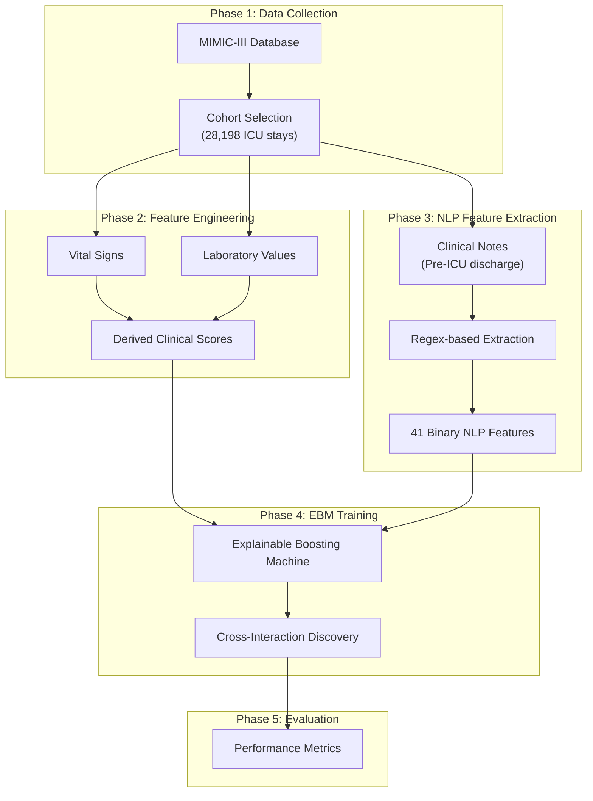
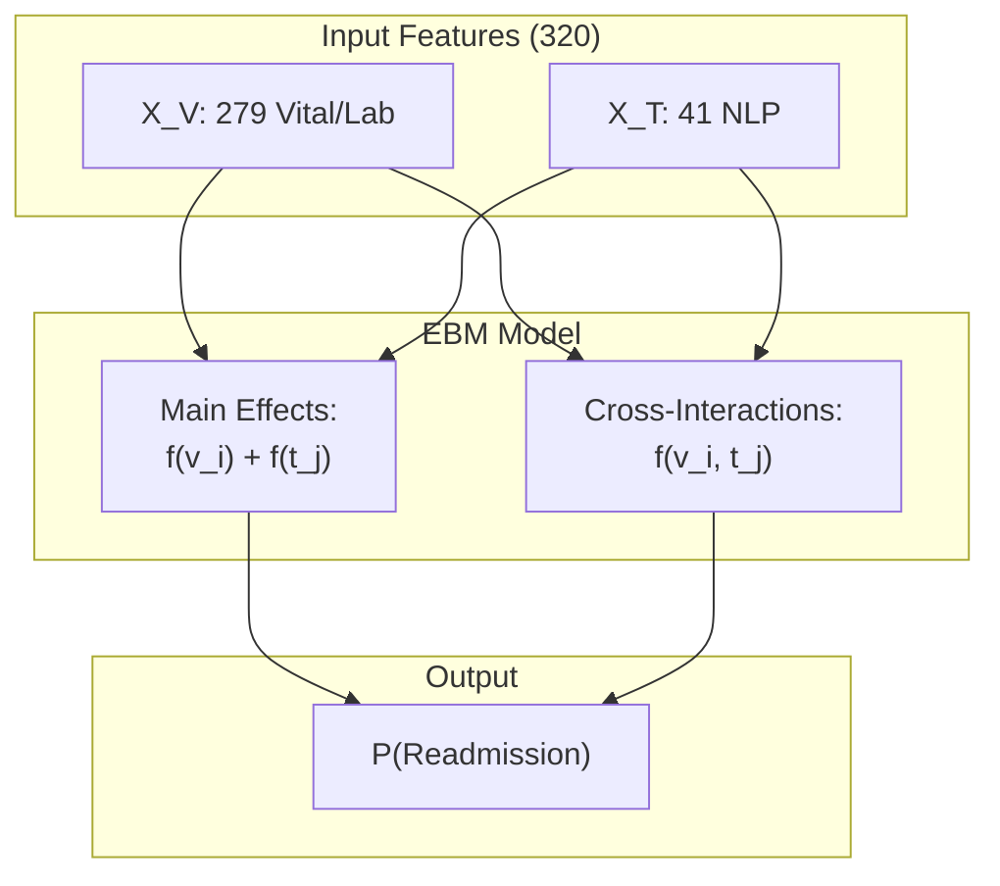
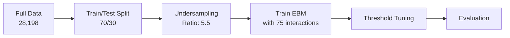

# ICU Readmission Prediction: Methodology & Architecture

> **Note:** All numbers in this document are verified from the codebase.

---

## 1. Overall Framework

---

## 2. Cohort Statistics

**Source:** `cohort/new_cohort_icu_readmission_labels.csv`

| Metric | Value |
|--------|-------|
| Total ICU stays | 28,198 |
| Non-readmitted (Y=0) | 26,403 (93.63%) |
| Readmitted (Y=1) | 1,795 (6.37%) |

**Final Training Dataset:** `cohort/features_phase4_clinical.csv`
- Rows: 17,599 patients
- Features: 320 (after preprocessing)

---

## 3. Feature Engineering

**Source:** `outputs/ebm_optimized_final/model_metrics.json`

### Feature Breakdown

| Category | Count | Source |
|----------|-------|--------|
| X_V (Vital/Lab) | 279 | CHARTEVENTS, LABEVENTS |
| X_T (NLP) | 41 | NOTEEVENTS |
| **Total** | **320** | |

### 3.1 Vital/Lab Features (X_V = 279)

Aggregations applied to each vital sign:
- Min, Max, Mean, Median, Std
- First, Last, Count
- Slope (trend over time)
- Monitoring intensity

**Derived Scores:**
- Shock_Index (HR/SBP)
- MAP_Avg
- Modified_Shock_Index
- Pulse_Pressure
- ROX_Index
- BUN_Creatinine_Ratio
- GCS_Decline
- Sepsis_Risk_Proxy

### 3.2 NLP Features (X_T = 41)

**Source:** `LLM_Explanation/nlp_extractor.py`

41 clinical concepts extracted via regex pattern matching:

| Category | Features |
|----------|----------|
| Infections | sepsis, pneumonia, cellulitis, uti, fever |
| Cardiovascular | heart_failure, arrhythmia, hypotension, hypertension, cardiac_arrest, myocardial_infarction, stroke, dvt_pe |
| Respiratory | respiratory_failure, ards, copd, pleural_effusion, intubation |
| Renal | chronic_kidney_disease, acute_kidney_injury |
| Hepatic | liver_failure |
| Hematologic | thrombocytopenia, anemia, coagulopathy, gi_bleed |
| Metabolic | electrolyte_imbalance, acidosis, diabetes, pancreatitis |
| Neurologic | altered_mental_status, seizure |
| Procedures | surgery, central_line, vasopressors |
| Other | unstable, edema, pressure_ulcer, falls, pain, code_status, icu_admission |

**Data Leakage Prevention:**
- Only notes with `CHARTTIME < ICU_OUTTIME`
- Categories used: Nursing, Nursing/other, Physician
- Excluded: Discharge summaries

---

## 4. Model Architecture

### 4.1 Explainable Boosting Machine (EBM)

### 4.2 Model Configuration

**Source:** `outputs/ebm_optimized_final/model_metrics.json`

| Parameter | Value |
|-----------|-------|
| n_features | 320 |
| n_vital_features | 279 |
| n_nlp_features | 41 |
| n_cross_interactions | 75 |
| undersampling_ratio | 5.5 |
| seed | 170 |
| model_type | EBM_cross_interaction |

### 4.3 Cross-Interactions (V × T)

**Source:** `outputs/ebm_optimized_final/forced_interactions.json`

75 cross-interactions between vital and NLP features.

**Example interactions:**
- Lactate_Monitoring_Intensity × nlp_sepsis
- Lactate_Monitoring_Intensity × nlp_liver_failure
- Ventilation_x_LOS_Hospital × nlp_intubation

---

## 5. Training Configuration

---

## 6. Performance Metrics

**Source:** `outputs/ebm_optimized_final/model_metrics.json`

| Metric | Value |
|--------|-------|
| **Threshold** | 0.535 |
| **F1-Score** | 75.22% |
| **Precision** | 75.22% |
| **Recall** | 75.22% |
| **AUC-ROC** | 97.78% |
| **AUC-PR** | 81.55% |
| **Accuracy** | 96.42% |

---

## 7. Mathematical Formulation

**EBM Model:**

$$
\log\left(\frac{P(Y=1|X)}{1-P(Y=1|X)}\right) = \beta_0 + \sum_{i=1}^{279} f_i(x_i^V) + \sum_{j=1}^{41} g_j(x_j^T) + \sum_{(i,j) \in S} h_{ij}(x_i^V, x_j^T)
$$

Where:
- $f_i$: Shape function for vital feature $i$
- $g_j$: Shape function for NLP feature $j$  
- $h_{ij}$: Interaction function for pair $(i,j)$
- $S$: Set of 75 selected cross-interactions
- $\beta_0$: Intercept

---

## 8. File References

| File | Description |
|------|-------------|
| `cohort/features_phase4_clinical.csv` | Final features (17,599 × 329) |
| `cohort/nlp_features.csv` | NLP features with CLEAN_TEXT |
| `cohort/notes_before_icu_out.csv` | Pre-ICU clinical notes |
| `outputs/ebm_optimized_final/final_model.pkl` | Trained EBM model |
| `outputs/ebm_optimized_final/model_metrics.json` | Performance metrics |
| `outputs/ebm_optimized_final/feature_info.json` | Feature names |
| `outputs/ebm_optimized_final/forced_interactions.json` | 75 cross-interactions |
